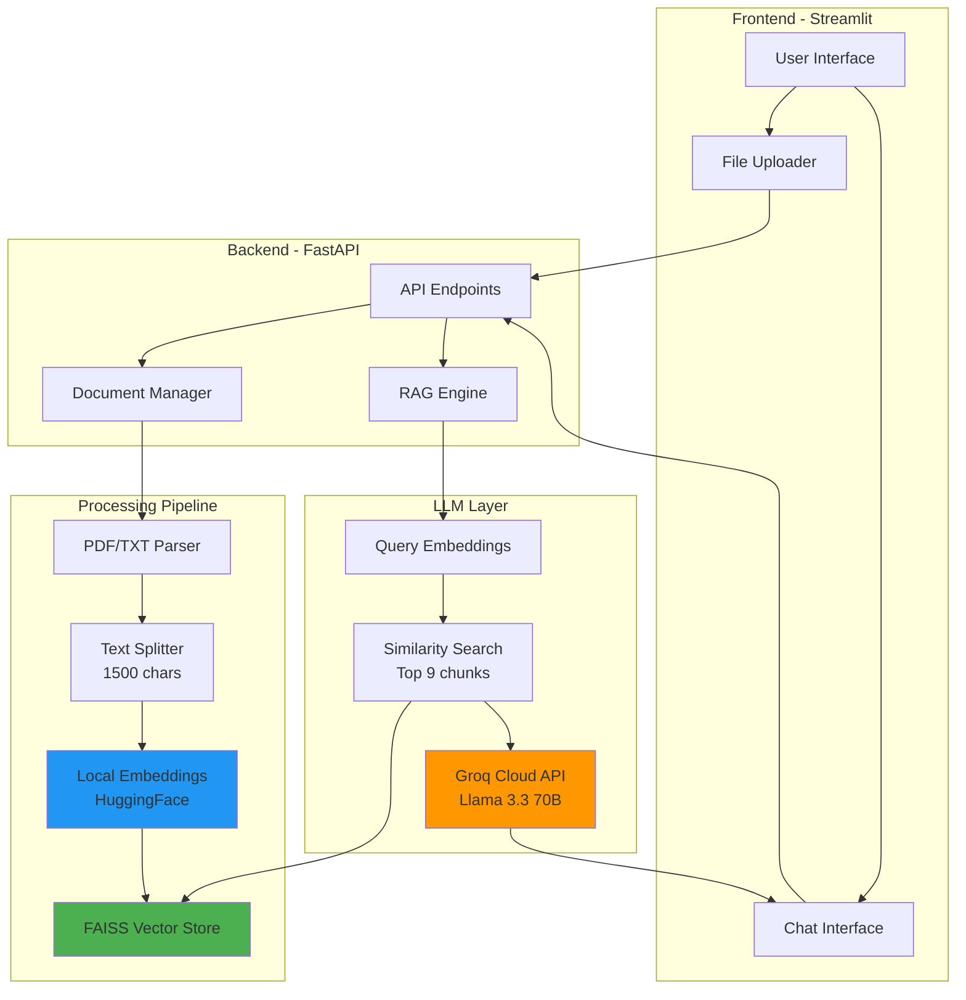

# 📚 RAG Document Q&A System

A **free, cloud-powered** AI document question-answering system using Retrieval Augmented Generation (RAG). Upload PDFs or text files and ask questions in natural language!

<div align="center">


**An intelligent document Q&A system powered by RAG (Retrieval-Augmented Generation)**

[Live Demo](#) • [Documentation](#quick-start) • [Report Bug](../../issues) • [Request Feature](../../issues)

</div>

## 📸 Demo


## 🎯 What is This?

Ever wished you could chat with your PDFs? This is a **production-ready RAG (Retrieval-Augmented Generation)** system that lets you:

- 📄 **Upload** any PDF or text document
- 💬 **Ask questions** in natural language
- 🎯 **Get accurate answers** grounded in your documents
- 📚 **Source Citations** - know exactly where each answer comes from
- 🔍 **Filter by file** - search specific documents by name
- 💾 **Persistent storage** - your documents and chat history survive restarts

**Perfect for**: Research papers, legal documents, manuals, reports, study materials, or any text-heavy content you need to understand quickly.

## ✨ Key Features

### 🧠 **Intelligent Q&A**
- Ask questions in natural language
- Context-aware responses from Llama 3.3 70B via Groq
- Automatic source citation with chunk references

### 🎯 **Smart Document Filtering**
- Ask "What is in report.pdf?" to search only that file
- Or search across all documents simultaneously
- Automatic filename detection in queries

### 💡 **Developer-Friendly**
- **100% Free** - Groq free tier (30 requests/min)
- **No GPU needed** - Embeddings run on CPU
- **Fast setup** - 5 minutes from clone to running
- **Clean architecture** - FastAPI backend + Streamlit frontend

### 📊 **Production Features**
- Persistent vector storage (FAISS)
- Chat history with timestamps
- Document management (upload/delete/list)
- Error handling and rate limiting
- Health checks and monitoring endpoints

## 🏗️ System Architecture



### 🔄 How It Works

1. **Document Upload** → PDF/TXT parsed → Split into 1500-char chunks
2. **Embedding** → Each chunk embedded using HuggingFace (local, free)
3. **Storage** → Embeddings stored in FAISS vector database
4. **Query** → User question embedded → Find top 9 similar chunks
5. **Generation** → Groq (Llama 3.3 70B) generates answer from chunks
6. **Response** → Answer + source citations returned to user

## 🛠️ Tech Stack

| Component | Technology | Why? |
|-----------|-----------|------|
| **Backend** | FastAPI | Fast, modern, async Python framework |
| **Frontend** | Streamlit | Rapid prototyping, beautiful UI out-of-the-box |
| **LLM** | Groq (Llama 3.3 70B) | Fastest inference, free tier, excellent quality |
| **Embeddings** | HuggingFace MiniLM | Local, free, no API costs |
| **Vector DB** | FAISS | Fast similarity search, persistent storage |
| **Orchestration** | LangChain | RAG pipeline management |
| **Document Parsing** | PyPDF | Reliable PDF text extraction |

## 📋 Prerequisites

Before you begin, ensure you have:

- ✅ **Python 3.11+** installed
- ✅ **Groq API Key** (free) - [Get it here](https://console.groq.com)
- ✅ **~2GB disk space** for dependencies
- ✅ **Basic terminal/command line knowledge**

## 🚀 Quick Start

### 1️⃣ Clone the Repository

```bash
git clone https://github.com/swati048/rag-document-qa.git
cd rag-document-qa
```

### 2️⃣ Get Your Free Groq API Key

1. Visit [console.groq.com](https://console.groq.com)
2. Sign up (free) with Google/GitHub
3. Navigate to "API Keys" → "Create API Key"
4. Copy your key (starts with `gsk_...`)

### 3️⃣ Set Up Environment

```bash
# Create virtual environment
python -m venv venv

# Activate it
# On Mac/Linux:
source venv/bin/activate
# On Windows:
venv\Scripts\activate

# Install dependencies
pip install -r requirements.txt
```

### 4️⃣ Configure API Key

Create a `.env` file in the project root:

```bash
# .env
GROQ_API_KEY=gsk_your_actual_api_key_here
```

⚠️ **Important**: Never commit this file! It's already in `.gitignore`.

### 5️⃣ Run the Application

**Terminal 1 - Backend:**
```bash
cd backend
python main.py
```
Backend runs at `http://localhost:8000`

**Terminal 2 - Frontend:**
```bash
cd frontend
streamlit run app.py
```
Frontend opens at `http://localhost:8501`

### 6️⃣ Start Chatting!

1. Upload a PDF or TXT file in the sidebar
2. Wait for indexing to complete (~10-30 seconds)
3. Ask questions in the chat interface
4. Enjoy AI-powered answers with source citations! 🎉

## 📚 Usage Examples

### Basic Questions
```
❓ "What is the main topic of this document?"
❓ "Summarize the key findings"
❓ "What are the conclusions?"
❓ "Who are the authors mentioned?"
```

### File-Specific Queries
```
❓ "What is in research_paper.pdf?"
❓ "Summarize report.txt"
❓ "What does contract.pdf say about payment terms?"
```

### Advanced Queries
```
❓ "Compare the methodologies in section 2 and section 4"
❓ "What recommendations are mentioned in the conclusion?"
❓ "List all the statistics about climate change"
```

## 🎨 Project Structure

```
rag-document-qa/
├── backend/
│   ├── __init__.py              # Empty init file
│   ├── config.py                # Configuration & API keys
│   ├── document_manager.py      # Upload, delete, list docs
│   ├── rag_engine.py           # RAG logic with Groq & FAISS
│   └── main.py                 # FastAPI app & endpoints
│
├── frontend/
│   └── app.py                  # Streamlit UI
│
├── data/                       # Created automatically
│   ├── uploads/                # Uploaded documents
│   ├── vectorstore/            # FAISS index
│   └── chat_history.json       # Persisted conversations
│
├── .env                        # API keys (YOU CREATE THIS)
├── .gitignore                  # Git ignore rules
├── requirements.txt            # Python dependencies
└── README.md                   # This file
```

## ⚙️ Configuration

Edit `backend/config.py` to customize:

```python
# LLM Model Selection
GROQ_MODEL = "llama-3.3-70b-versatile"  # Best quality (default)
# GROQ_MODEL = "llama-3.1-8b-instant"   # Faster responses

# Document Chunking
CHUNK_SIZE = 1500              # Characters per chunk
CHUNK_OVERLAP = 300            # Overlap between chunks

# Retrieval Settings
TOP_K_RESULTS = 9              # Number of chunks to retrieve

# Embeddings (local - no cost)
EMBEDDING_MODEL = "sentence-transformers/all-MiniLM-L6-v2"
```

## 💰 Cost & Limits

### Groq Free Tier
- ✅ **30 requests per minute**
- ✅ **14,400 tokens per minute**
- ✅ **No credit card required**
- ✅ **Access to Llama 3.3 70B**

**Models Available:**
- `llama-3.1-70b-versatile` ⭐ (default - best quality)
- `llama-3.1-8b-instant` (faster)
- `mixtral-8x7b-32768` (good balance)

### Cost Breakdown
| Operation | API Calls | Cost |
|-----------|-----------|------|
| Upload document | 0 | FREE (local embeddings) |
| Each question | 1 | FREE (within limits) |
| **Daily usage** | ~100-200 | **100% FREE** ✅ |

**Typical Usage**: 100-200 questions per day = completely free!

## 🌐 Deployment

### Streamlit Cloud (Frontend) + Render (Backend)

**Pros**: 
- ✅ Free hosting for both
- ✅ Auto-restarts on code push
- ✅ HTTPS by default
- ✅ Easy to manage

**Cons**:
- ⚠️ Render free tier sleeps after 15 min inactivity (30s cold start)
- ⚠️ Streamlit Cloud has resource limits

## 🧪 Testing the API

### Health Check
```bash
curl http://localhost:8000/health
```

### Upload Document
```bash
curl -X POST http://localhost:8000/upload \
  -F "file=@document.pdf"
```

### Ask Question
```bash
curl -X POST http://localhost:8000/query \
  -H "Content-Type: application/json" \
  -d '{"question": "What is this document about?"}'
```

## 🐛 Troubleshooting

### "GROQ_API_KEY not found"
```bash
# Check .env file exists
ls -la .env

# Verify it contains:
GROQ_API_KEY=gsk_...
```

### "Backend not reachable"
```bash
# Test backend
curl http://localhost:8000/health

# Should return JSON
```

### "Rate limit exceeded"
- Wait 60 seconds
- You've hit 30 requests/minute limit
- Consider switching to `llama-3.1-8b-instant` in config

### Slow first query
- First query loads embedding model (~5-10s)
- Subsequent queries are faster (1-3s)
- This is normal!

### Documents not indexing
- Check file size (PDFs >50MB may timeout)
- Check backend logs for errors
- Ensure GROQ_API_KEY is valid

## 🔒 Security Best Practices

1. ✅ **Never commit `.env`** - Already in `.gitignore`
2. ✅ **Rotate API keys** if exposed
3. ✅ **Use environment variables** in production
4. ✅ **Enable HTTPS** for production deployments
5. ✅ **Add authentication** if handling sensitive documents

## 🚀 Future Enhancements

- [ ] Support DOCX, XLSX, CSV files
- [ ] Multi-language support
- [ ] User authentication
- [ ] Document comparison mode
- [ ] Export chat history
- [ ] OCR for scanned PDFs
- [ ] Advanced filters (date, author, tags)
- [ ] Batch processing
- [ ] Vector store backup/restore

**Want to contribute?** Open an issue or PR!

## 📊 Performance Benchmarks

| Metric | Value |
|--------|-------|
| First query (cold start) | 5-10s |
| Subsequent queries | 1-3s |
| Document upload (10 pages) | 15-30s |
| Embedding speed | ~1000 chars/sec |
| Vector search | <100ms |
| Max file size tested | 100MB PDF |

## 🤝 Contributing

This is a portfolio project, but suggestions are welcome!

1. Fork the repository
2. Create a feature branch (`git checkout -b feature/AmazingFeature`)
3. Commit changes (`git commit -m 'Add AmazingFeature'`)
4. Push to branch (`git push origin feature/AmazingFeature`)
5. Open a Pull Request

## 📄 License

This project is licensed under the MIT License - see [LICENSE](LICENSE) file for details.

## 🙏 Acknowledgments

- [LangChain](https://langchain.com) - RAG orchestration framework
- [Groq](https://groq.com) - Lightning-fast LLM inference
- [FAISS](https://github.com/facebookresearch/faiss) - Efficient vector search
- [Streamlit](https://streamlit.io) - Beautiful UI framework
- [HuggingFace](https://huggingface.co) - Free local embeddings
- [FastAPI](https://fastapi.tiangolo.com) - Modern Python web framework

## 👤 Author

**Swati Thakur**
- GitHub: [@swati048](https://github.com/swati048)
- LinkedIn: [Swati Thakur](https://linkedin.com/in/swati048)
- Email: [thakurswati048@gmail.com](mailto:thakurswati048@gmail.com)

---

<div align="center">

**⭐ Star this repository if you found it helpful! ⭐**

**Built with ❤️ using Groq's free tier**

</div>